# Library Management System

This is a simple library management system built for Major Project 2021 by Abhik Bhattacharya (id : 181001102058) & Saikat Shee (id : 181001102053 )

<!-- ### It is deployed [here](https://abhik-b.github.io/pomodro-timer/) -->

This project is built with :

 ,  ,  ,  ,  ,

---

## Features of this project:

##### Anyone can

1. see all the books in homepage
2. search books based on author or name of the book or category of the book
3. sort books or author alphabetically

##### Student can

1.  login / signup ,
2.  can request book
3.  see their own issues and filter them based on :

    - requested issues ,
    - issued books or
    - all of them together

4.  check their own fines
5.  can see

    - the days remaining to return a particular book
      **or**
    - the number of days passed the return date of a particular book in the my fines page

6.  Pay their fines online (powered by RazorPay)

##### Admin can

1.  login to admin dashboard
2.  check all issues :

    - see issues ,
    - delete issues ,
    - search issues by studentid
    - filter issues based on :

      - issued or not,
      - returned or not ,

3.  accept a issue :

    - from the dashboard where admin has to manually select return date
      **or**
    - from the Issue requests page where return date is automatically calculated

4.  add , delete search books and filter books based on author
5.  add , delete , search author
6.  calculate fine by clicking a button ,
7.  create, delete fine ,search fines for studentid
8.  toggle fine paid status (if paid in cash)
9.  search ,modify,add,delete students , filter them based on department and check all fines and issues of that student
10. can see the last-login , date joined & the student associated to a particular user
11. can change password for any user

##### More ...

1. while signing up if studentID is already associated to a user in this platform then it will show a error without reloading the page and as soon as correct id is given then the error will go away
2. Books in homepage will show status of `issued` , `issue requested` or `request issue` based on whether the book is issued or requested for a issue or is not requested for logged-in students only

---

## Behind the scenes

### Student app

We need this for writing our authentication views as well as student & department models. Student model has the first+last name ,department foreignkey and studentID which is one-to-one field to Django' User model. We use Django's User Model for authentication . There will be 3 views: login,signup and logout. The urls will have `/student/< login or signup or logout >/`.

### Library app

This is our main app where we will write our library system's main logic. It comprises of 4 models:

- **Author** - for storing name & description of author
- **Book** - for storing name , image ,category of a book & connecting to the author
- **Issue** - for tracking each & every issue a student requests. It will also track the book for which issue is requested , issue status (whether issued or not) , return status (whether returned or not) , return date (last date to return the book) and more...
- **Fine** - for tracking the fines & calculating fines automatically for each student whose issued book/s is/are not returned and the last date is passed

---

## Some important logics :

**Student ID** - Username of Django's User Model serves as our studentID

**Signing Up** - so every student who signs up creates a new user instance with his/her student id as the username and then a student instance is also created with the names and department and this user we just created.

**Calculating Fine - How ??** -
We run a for loop and pass all the issues to this calculate fine function. Then:

- for each issue , check whether the issue is issued or not (if issue is not issued then no need to calculate fines)

  - if issue is issued then check whether issue is returned or not (if issue is returned then no need to calculate fines)

    - if issue is not returned then check whether the issue's return date is passed or not (if not passed then no calculation of fines is needed)
      - create or get a fine instance with student & issue then calculate the amount and save it to the amount field

**Calculating Fine - When ??** -

- Whenever admin clicks on "_Calculate Fine_" button
- Whenever a student opens his "_My Fines_" page

**Payment of Fines**

- when a student clicks on pay button (in myfines page)
- we create a razorpay order with a dict containing fine amount (coverted to int and multiplied by 100 because razorpay wants in paisa) , order_id, currency
- then we send the user to the payfines page (payfines.html) with the amount (in paisa ) , razorpay key id, razorpay order id & amount (which should be displayed)
- user chooses proceed to payment online , selects paymode (Netbanking , Card , Wallet etc.) and pays the amount
- we verify the payment status whether success or failure
- then payment is (successfull/failure) message is shown on myfine page with (paid status / pay button) beside that fine

## Screenshots

- Signup Page
  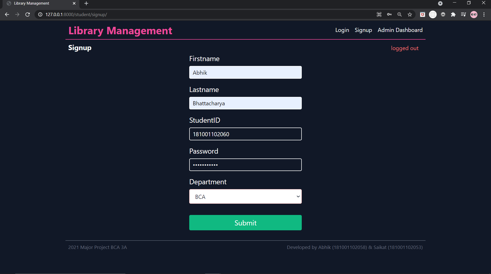
- Login Page
  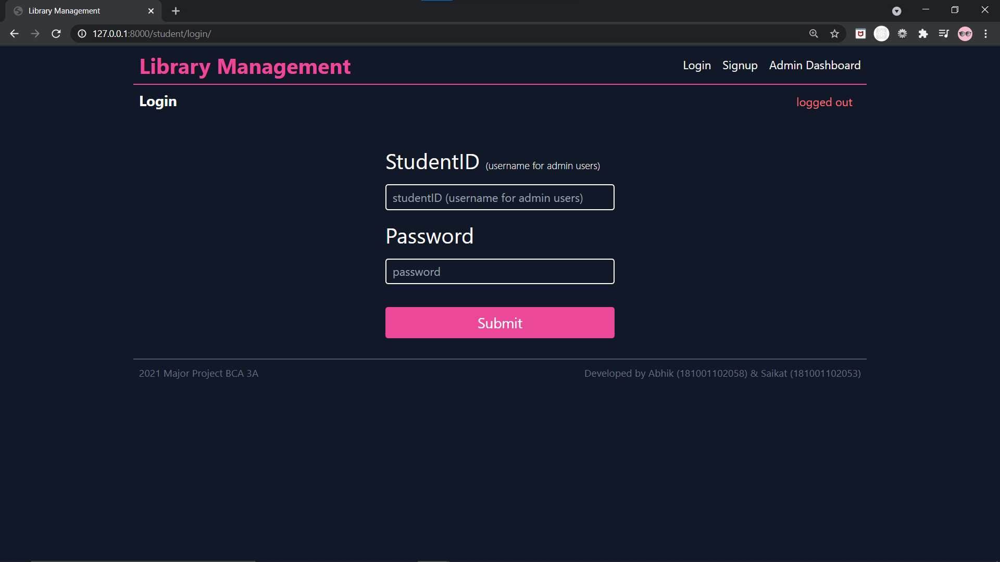
- If Student ID already signed up
  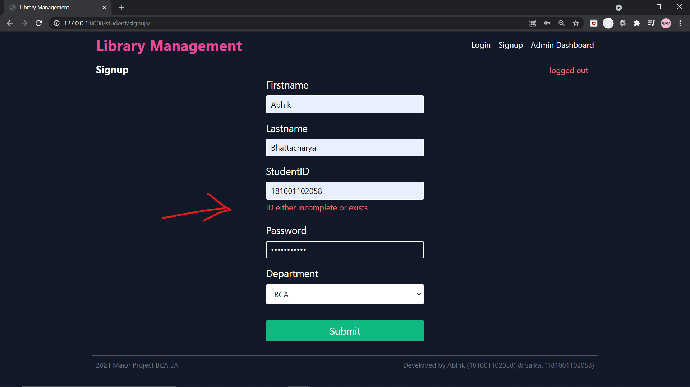

- Home Page for student
  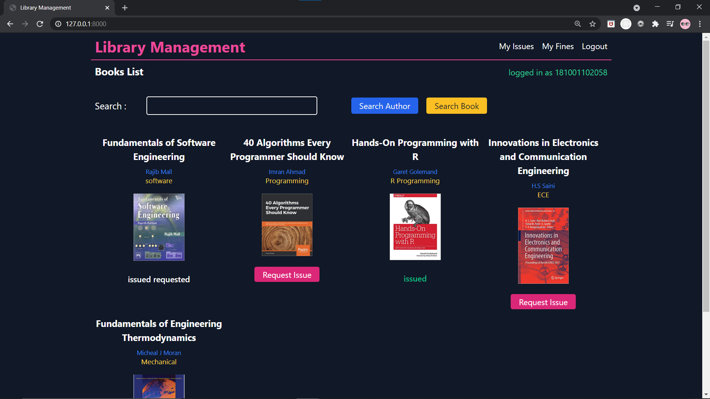
- Search Book
  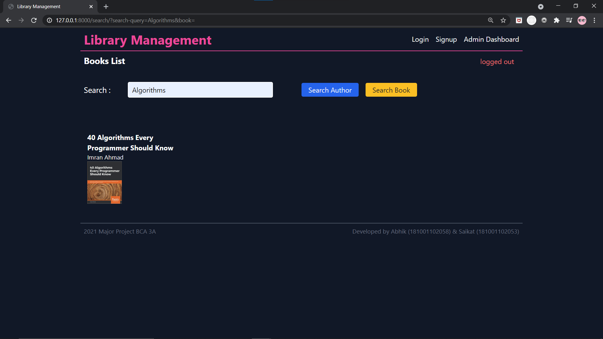
- Search Author
  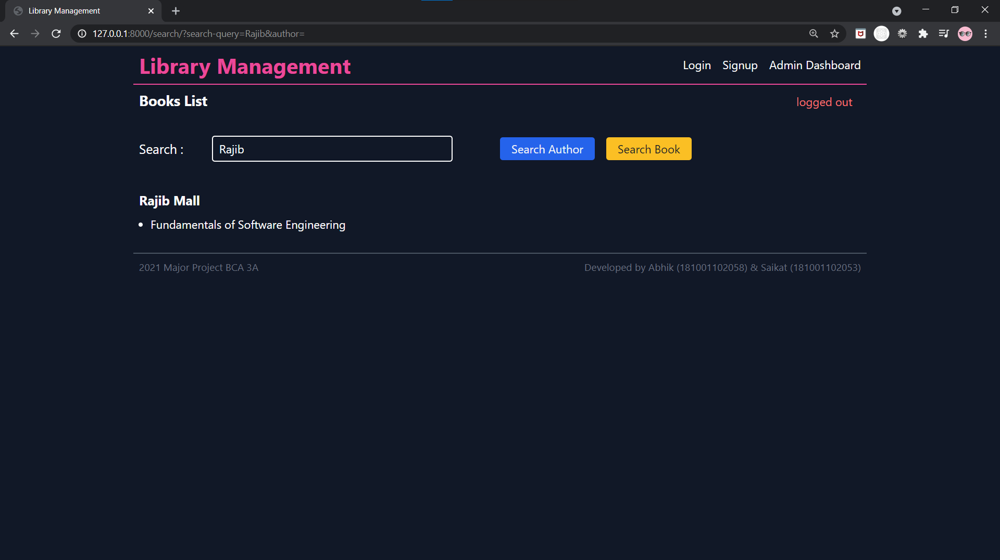

- My Issues
  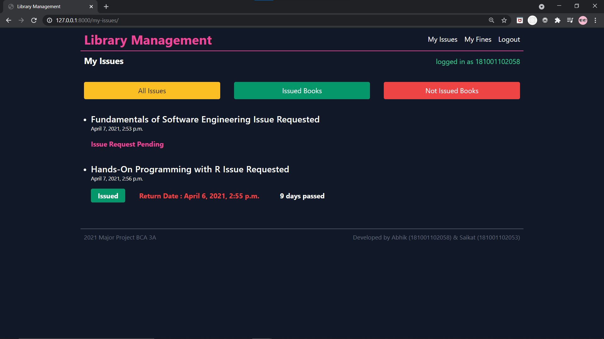
- My Fines
  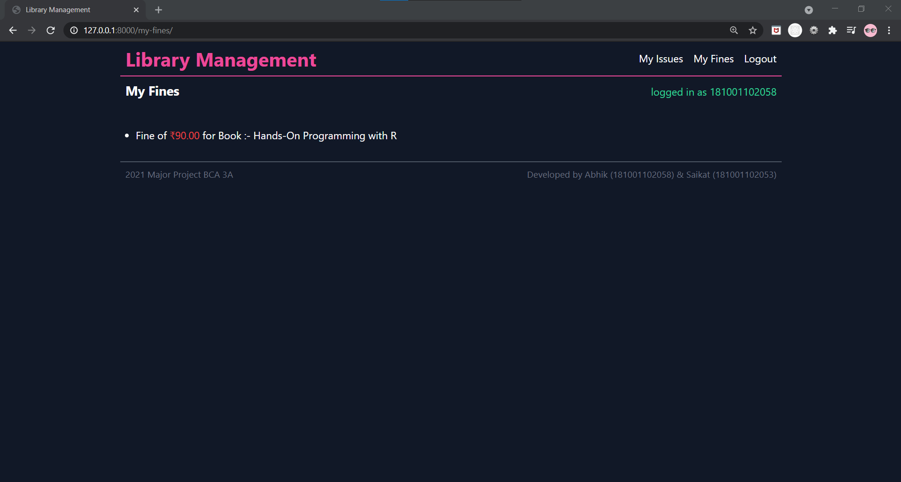
- Confirm Payment
  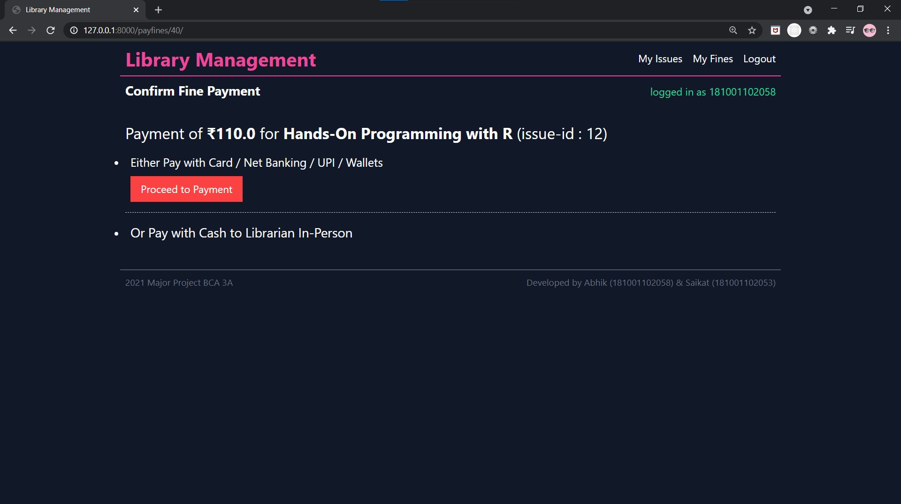
- Choose Payment Modes
  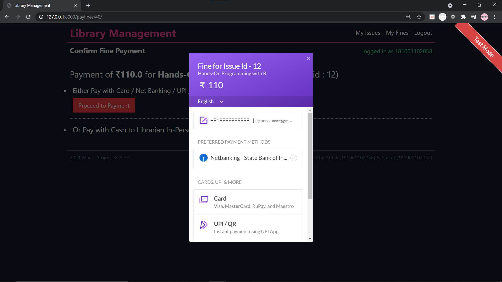
- Pay Success
  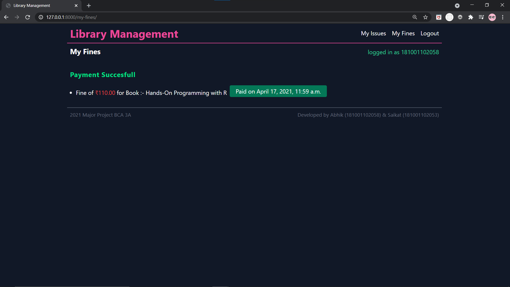

- Admin Dashboard
  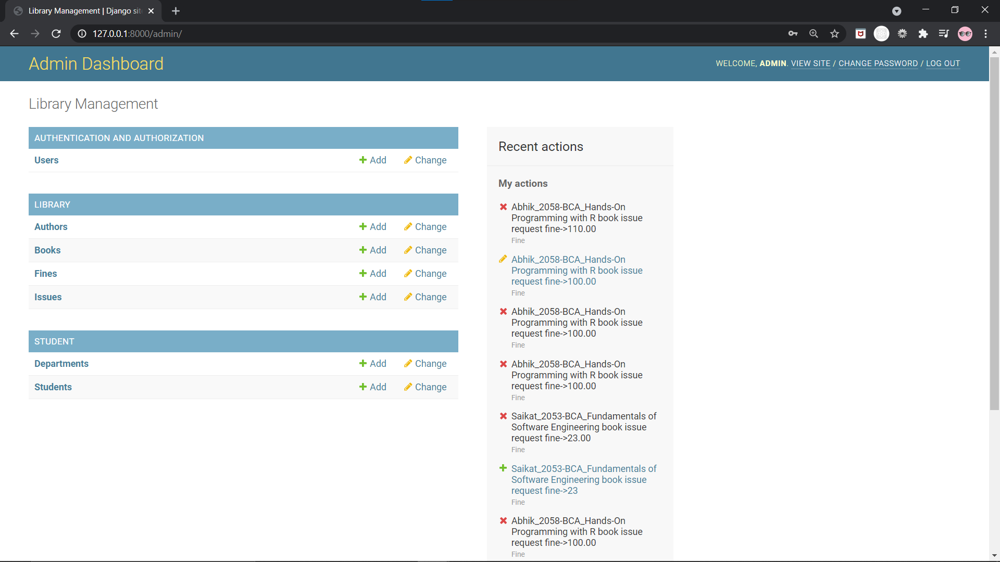

- All Books (Admin)
  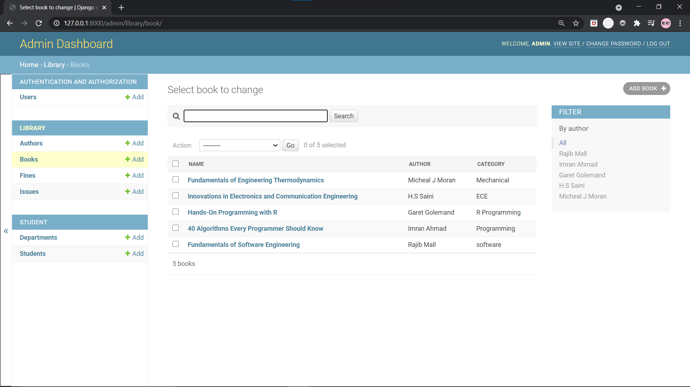

- All issues , can be filtered ,searched (Admin)
  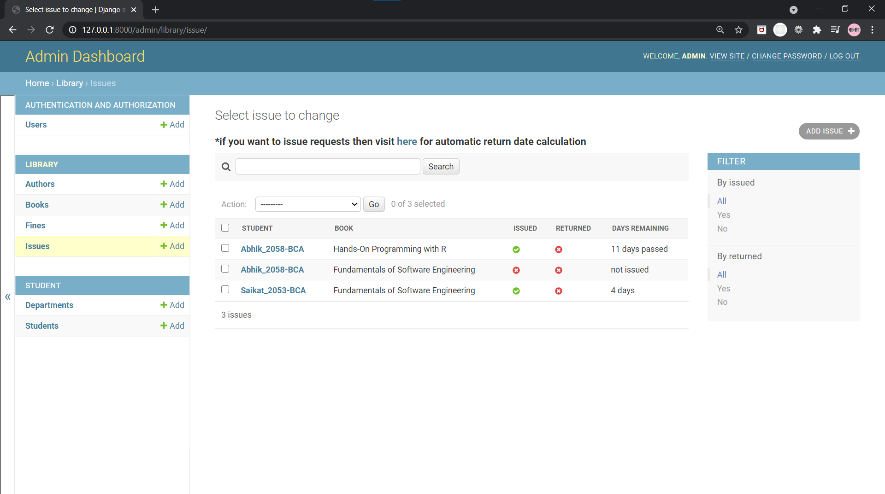
- Requested Issues (Admin)
  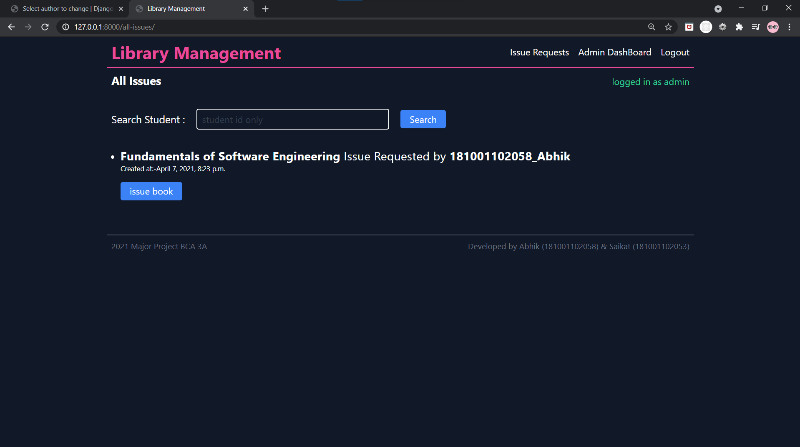

- All fines , can be filtered ,searched (Admin)
  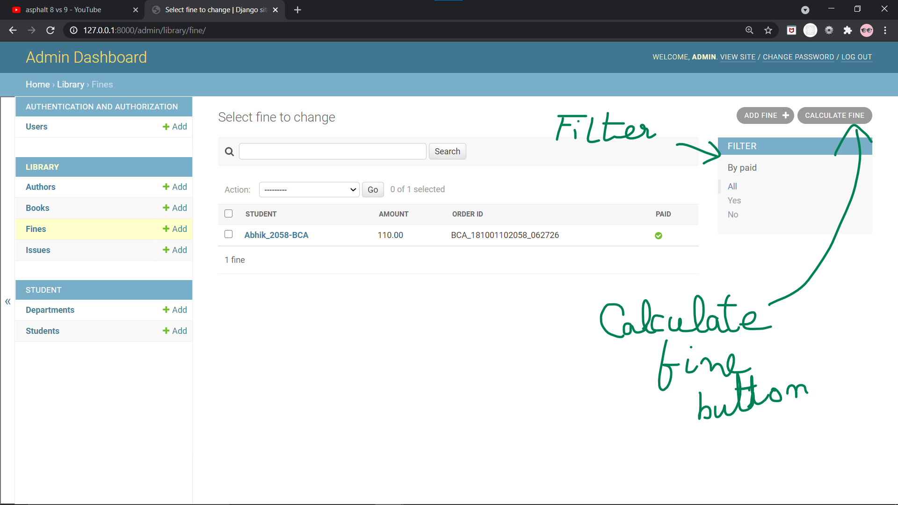

- All Students , can be filtered ,searched (Admin)
  
- Student Details (Admin)
  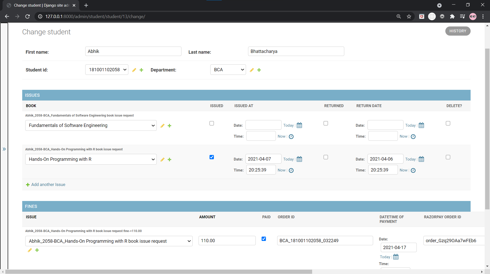
- User Details (Admin)
  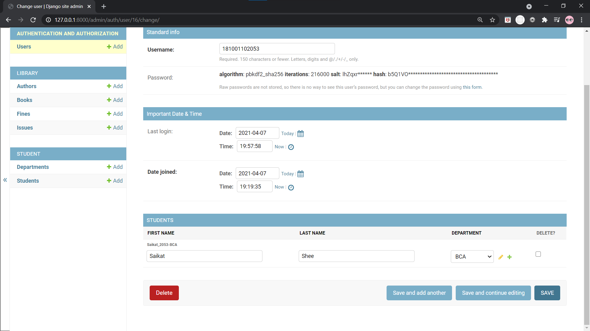
  19
